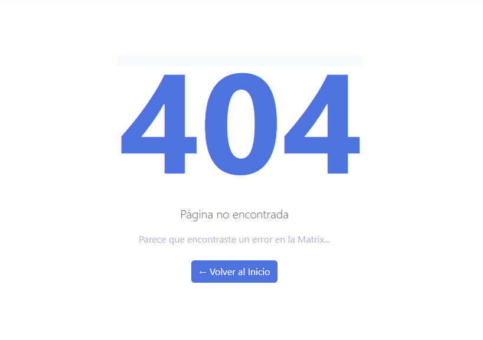
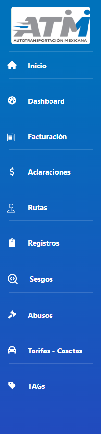
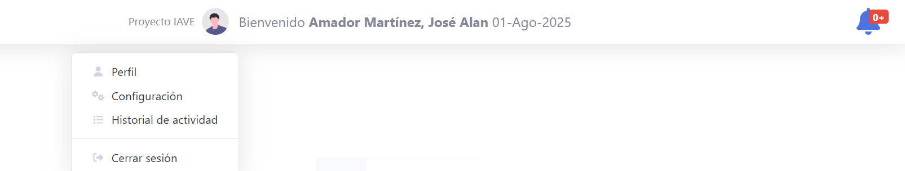

# Documentación de Componentes Frontend - IAVE WEB

## Índice
1. [App.js](#appjs)
2. [Abusos.jsx](#abusosjsx)
3. [Aclaraciones.jsx](#aclaracionesjsx)
4. [Casetas.jsx](#casetasjsx)
5. [Cruces.jsx](#crucesjsx)
6. [Footer.jsx](#footerjsx)
7. [NotFound.jsx](#notfoundjsx)
8. [nuevocomponente.jsx](#nuevocomponentejsx)
9. [Route-Creator.jsx](#route-creatorjsx)
10. [Rutas.jsx](#rutasjsx)
11. [Sesgos.jsx](#sesgosjsx)
12. [sidebar.jsx](#sidebarjsx)
13. [Tags.jsx](#tagsjsx)
14. [Topbar.jsx](#topbarjsx)

---

## App.js

### Descripción General
`App.js` es el componente raíz de toda la aplicación IAVE WEB. Es responsable de:
- Configurar el enrutador principal (BrowserRouter)
- Definir la estructura de layout de la aplicación (Sidebar, Topbar, Footer)
- Gestionar todas las rutas de la aplicación
- Envolver toda la aplicación con contexto de enrutamiento

### Estructura de Layout


### Rutas Definidas
| Ruta | Componente | Descripción |
|------|-----------|-------------|
| `/` | `<Cruces />` | Página de inicio - Detalle de Cruces |
| `/Home` | `<Home />` | Página de inicio alternativa |
| `/aclaraciones` | `<Aclaraciones />` | Módulo de aclaraciones de peaje |
| `/abusos` | `<AbusosModule />` | Módulo de abusos/infracciones |
| `/cruces` | `<Cruces />` | Módulo de cruces/registros |
| `/rutas` | `<RutasModule />` | Visor de rutas |
| `/rutas-testing` | `<RutasModule />` | Rutas en modo testing |
| `/mapas-testing` | `<MapaContent />` | Mapas en modo testing |
| `/dashboard` | `<Cruces />` | Dashboard principal |
| `/casetas` | `<Casetas />` | Gestión de casetas y tarifas |
| `/tags` | `<Tags />` | Gestión de dispositivos TAG |
| `/sesgos` | `<Sesgos />` | Gestión de sesgos/anomalías |
| `/nuevocomponente` | `<Example />` | Componente de prueba |
| `/route-creator` | `<RouteCreator />` | Creador de rutas interactivo |
| `*` (404) | `<NotFound />` | Página no encontrada |

### Dependencias
- `react-router-dom`: Enrutamiento
- Componentes propios del sistema


## Abusos.jsx

### Descripción General
`Abusos.jsx` es el componente padre del módulo de Abusos. Los abusos son cruces de operadores por casetas que no están en la ruta definida o en días que no se encontraban en operación.

### Funcionalidades
- Mostrar estadísticas de abusos registrados
- Listar todos los abusos del sistema
- Visualizar estado de procesamiento de abusos
- Permitir actualización de estatus de abusos

### Estados Secundarios de Abusos
- `pendiente_reporte`: Abuso detectado, pendiente de reporte
- `reporte_enviado_todo_pendiente`: Reporte enviado, pendiente aplicación
- `descuento_aplicado_pendiente_acta`: Descuento aplicado, pendiente acta
- `acta_aplicada_pendiente_descuento`: Acta aplicada, pendiente descuento
- `completado`: Proceso completo
- `condonado`: Perdonado/anulado

### Componentes Hijos
- `<Stats />`: Muestra estadísticas agregadas de abusos
- `<AbusosTable />`: Tabla interactiva con listado de abusos

### Props
No recibe props directamente. Los datos se obtienen mediante APIs.

### Estado Local
```javascript
// No mantiene estado local significativo
// El estado se gestiona en componentes hijos
```

### Flujo de Datos
```
Abusos (padre)
├── Stats (obtiene datos de API)
└── AbusosTable (obtiene datos de API)
```

### API Endpoints Utilizados
- `GET /api/abusos`: Obtiene todos los abusos
- `GET /api/abusos/stats`: Obtiene estadísticas

### Ejemplo de Respuesta API
```json
[
  {
    "ID_Matricula": 2354,
    "NombreCompleto": "Jesus",
    "FechaAbuso": "2025-09-26T00:00:00.000Z",
    "ID": "250926_17241_28484563",
    "Caseta": "PACHUCA",
    "No_Economico": "2354 Jesus Rodr",
    "Fecha": "2025-09-26T23:24:01.000Z",
    "Importe": 95,
    "Tag": "IMDM28484563",
    "Carril": "PACHUCA 1",
    "Clase": "1",
    "Consecar": "39301560",
    "FechaAplicacion": "2025-09-26T18:00:00.000Z",
    "Estatus": "Abuso",
    "id_orden": null,
    "observaciones": "Se tuvo el abuso después de un traslado que tenía de Planta Culiacán ? Patio TUSA Sahagún (OT-5091260).",
    "Estatus_Secundario": "completado",
    "Aplicado": true,
    "FechaDictamen": "2025-09-29T00:00:00.000Z",
    "ImporteOficial": 0,
    "NoAclaracion": null,
    "montoDictaminado": 95,
    "idCaseta": "",
    "Estado_Personal": null,
    "Nombres": "Jesus",
    "Apellidos": " "
  },
]
```

---

## Aclaraciones.jsx

### Descripción General
`Aclaraciones.jsx` es el componente padre del módulo de Aclaraciones. Las aclaraciones son tickets levantados en el portal PASE cuando hay diferencia en el cobro de peaje.

### Casos de Uso
- Se cobra una tarifa incorrecta (mayor a la programada)
- Hay error en clasificación del vehículo
- Duplicación de cobro de la caseta
- Error del sistema

### Estados Secundarios
- `pendiente_aclaracion`: Aclaración identificada, pendiente levantar en portal PASE
- `aclaracion_levantada`: Registrada en portal, pendiente dictaminación
- `dictaminado`: Dictamen emitido
- `completado`: Proceso finalizado

### Componentes Hijos
- `<Stats />`: Estadísticas de aclaraciones
- `<AclaracionesTable />`: Tabla de aclaraciones

### Cálculos Realizados
- **Diferencia**: `Importe - ImporteOficial`
- **Montos por estado**: Varían según estatus secundario

### API Endpoints
- `GET /api/aclaraciones`: Lista todas las aclaraciones
- `GET /api/aclaraciones/stats`: Obtiene estadísticas


### Ejemplo de Respuesta API
```json
[
  {
    "ID": "251002_235747_28967172",
    "Caseta": "TAMPICO",
    "No_Economico": "2386 Gabriel Fu",
    "Fecha": "2025-10-03T05:57:47.000Z",
    "Importe": 82,
    "Tag": "IMDM28967172",
    "Carril": "TAMPICO 2",
    "Clase": "10",
    "Consecar": "39422335",
    "FechaAplicacion": "2025-10-03T18:00:00.000Z",
    "Estatus": "Aclaración",
    "id_orden": "OT-5091325",
    "observaciones": null,
    "Estatus_Secundario": "dictaminado",
    "Aplicado": null,
    "FechaDictamen": null,
    "ImporteOficial": 76,
    "NoAclaracion": null,
    "montoDictaminado": 0,
    "idCaseta": "296",
    "ID_clave": "C-2 ", ←
    "Nombre_IAVE": "Tampico", ←
    "Automovil": 35, ←
    "Camion2Ejes": 76, ←
    "Camion3Ejes": 76, ←
    "Camion5Ejes": 140, ←
    "Camion9Ejes": 195, ←
    "latitud": "22.218325", ←
    "longitud": "-97.824741", ←
    "Estado": "Tamaulipas", ←
    "diferencia": 6 ←
  },
]
```

---


### Datos Enriquecidos (* ← *)
Cada registro incluye:
- Información de orden de traslado (ID_clave)
- Datos de caseta (nombre, tarifas, ubicación)
- Diferencia de cobro calculada

---

## Casetas.jsx

### Descripción General
`Casetas.jsx` es el componente padre para la gestión y actualización de tarifas de casetas (estaciones de peaje).

### Funcionalidades
- Visualizar información de casetas activas
- Actualizar tarifas de peaje por clasificación de vehículo
- Consultar ubicación geográfica de casetas

### Clasificaciones de Vehículos
- Automóvil (A)
- Autobús 2 Ejes (B)
- Camión 2 Ejes (C-2)
- Camión 3 Ejes (C-3)
- Camión 4 Ejes (C-4)
- Camión 5 Ejes (C-5)
- Camión 9 Ejes (C-9)

### Componentes Hijos
- `<CasetasTable />`: Tabla interactiva de casetas y tarifas

### Información Mostrada
- ID de caseta
- Nombre IAVE
- Ubicación (latitud, longitud)
- Estado
- Tarifas por clasificación de vehículo

### API Endpoints
- `GET /api/casetas`: Obtiene listado de casetas
- `PUT /api/casetas/:id`: Actualiza tarifas

---

## Cruces.jsx

### Descripción General
`Cruces.jsx` es el componente padre del módulo de Cruces/Registros. Los cruces son los registros de paso de vehículos a través de casetas de peaje.

### Funcionalidades Principales
- Visualizar todos los cruces registrados
- Mostrar estadísticas de cruces dictaminados (Aclaraciones, Abusos, Sesgos)
- Actualizar estatus de cruces
- Aplicar filtros y búsquedas

### Estados de Cruces actualmente definidos/identificados
- **Cruce Normal(Confirmado)**: Paso regular de vehículo
- **Aclaración**: Diferencia en cobro de peaje
- **Abuso**: Infracción por parte del operador
- **Sesgos**: Discrepancia en ruta o caseta

### Componentes Hijos
- `<Stats />`: Estadísticas de cruces dictaminados
- `<CrucesTable />`: Tabla interactiva con listado de cruces

### Datos por Cruce
- ID único del cruce
- Número económico (identificación del vehículo)
- Caseta
- Fecha y hora
- Importe cobrado
- Estatus actual
- Personal involucrado

### API Endpoints
- `GET /api/cruces`: Obtiene todos los cruces
- `GET /api/cruces/stats`: Estadísticas
- `PUT /api/cruces/:id`: Actualiza cruce
- `POST /api/cruces/import`: Importa cruces masivamente

### Observaciones
Actualmente sobre este componente hace falta implementar el cambio automático de las estadisticas (mediante el uso de  props).

---

## Footer.jsx

### Descripción General
`Footer.jsx` es un componente funcional simple que renderiza el pie de página de la aplicación.

### Características
- **Posición**: Sticky (fijo al final)
- **Contenido**: Año actual y copyright
- **Estilos**: Bootstrap (clase `sticky-footer bg-white`)

### Funcionalidad
```javascript
// Renderiza automáticamente el año actual
© {new Date().getFullYear()} ATM IAVE-WEB.
```

### Props
No recibe props.

### Estado
Ninguno. Es un componente puramente presentacional.

### Uso
```jsx
<Footer />
```

### Clases CSS
- `sticky-footer`: Fija el footer al final
- `bg-white`: Fondo blanco
- `text-center`: Texto centrado

---

## NotFound.jsx

### Descripción General
`NotFound.jsx` es el componente que se muestra cuando se accede a una ruta que no existe (Error 404).

### Características
- **Código de Error**: 404 (grande y prominente)
- **Interfaz**: Centrada y responsiva
- **Navegación**: Enlace para volver al inicio

### Elementos Visuales


```
┌─────────────────────┐
│       404           │ (15rem font size)
├─────────────────────┤
│ Página no encontrada│
│ Parece que          │
│ encontraste un      │
│ error en la Matrix..│
├─────────────────────┤
│ ← Volver al Inicio  │ (botón)
└─────────────────────┘
```



### Props
No recibe props.

### Funcionalidad
- Detecta rutas inválidas mediante React Router (`path="*"`)
- Proporciona enlace de navegación hacia `/` (inicio)

### Estilos
- Color: `#4e73df` (azul primario del tema)
- Alineación: Centro
- Margen superior: 5rem

### Uso
```jsx
<Route path="*" element={<NotFound />} />
```

---

## nuevocomponente.jsx

### Descripción General
`nuevocomponente.jsx` es un componente de testing que permite la ejecución de pruebas. Se encuentra actualmente enrutado en React, sin una href asignada aún (desde el sidebar o cualquier elemento)

### Funcionalidades
- Probar la disposición/maquetación de nuevos elementos visuales.

### Propósito
Componente de prueba/testing para demostración de funcionalidades.

---

## Route-Creator.jsx

### Descripción General
`Route-Creator.jsx` es un componente *avanzado* que implementa un creador interactivo de rutas de transporte con integración de mapas, cálculos de costos de peaje y vinculación de las rutas TUSA actuales.

### Funcionalidades Principales
- **Creación de Rutas**: Permite seleccionar origen, destino y puntos intermedios
- **Integración INEGI Sakbe v3.1**: Calcula rutas óptimas mediante API externa
- **Visualización en Mapas**: Muestra rutas en mapa interactivo (Leaflet)
- **Cálculo de Casetas**: Identifica casetas en la ruta
- **Cálculo de Costos**: Calcula importe total de peajes
- **Ruta TUSA**: Permite la visualización de la ruta actualmente registrada en TUSA que coincide con las poblaciones buscadas (De origen y destino).

### Estados Principales
```javascript
// Entrada del usuario
const [txtOrigen, setTxtOrigen] = useState('');
const [txtPuntoIntermedio, setTxtPuntoIntermedio] = useState('');
const [txtDestino, setTxtDestino] = useState('');
const [tipoVehiculo, setTipoVehiculo] = useState(5);

// Datos de búsqueda
const [origenes, setOrigenes] = useState([]);
const [destinos, setDestinos] = useState([]);
const [puntosIntermedios, setPuntosIntermedios] = useState([]);

// Resultados
const [rutas_OyL, setRutas_OyL] = useState(null);
const [rutaSeleccionada, setRutaSeleccionada] = useState([]);

// Estados de carga
const [loadingOrigen, setLoadingOrigen] = useState(false);
const [loadingDestino, setLoadingDestino] = useState(false);
const [loadingRutas, setLoadingRutas] = useState(false);
```

### Componentes de Mapa
- **MapContainer**: Contenedor principal (react-leaflet)
- **TileLayer**: Capa de mosaicos de mapa
- **Marker**: Marcadores de ubicaciones
- **Polyline**: Línea de ruta
- **Popup**: Información en marcadores

### Iconos Personalizados
- `markerATM`: Sede ATM (roja)
- `markerA`: Origen (verde)
- `markerB`: Destino (azul)
- `markerCaseta`: Casetas de peaje (verde)
- `markerPin`: Puntos intermedios

### Clasificaciones de Vehículos
| Código | Descripción |
|--------|------------|
| A | Automóvil |
| B | Autobús 2 Ejes |
| C-2 | Camión 2 Ejes |
| C-3 | Camión 3 Ejes |
| C-4 | Camión 3 Ejes |
| C-5 | Camión 5 Ejes |
| C-9 | Camión 9 Ejes |

### Funciones Principales
- `searchDestinations()`: Busca ciudades/poblaciones
- `getToken()`: Obtiene token de INEGI Sakbe
- `normalize()`: Normaliza nombres de ciudades
- `parsearFechaHora()`: Parsea fechas
- `createUniqueId()`: Crea ID único para cruce

### API Externa
- **INEGI Sakbe v3.1**: Cálculo de rutas óptimas
- **Token**: `Jq92BpFD-tYae-BBj2-rEMc-MnuytuOB30ST`

### Debouncing
Implementa debouncing para búsquedas:
```javascript
const origenTimeoutRef = useRef(null);
const destinoTimeoutRef = useRef(null);
const intermediosTimeoutRef = useRef(null);
```

### Datos Retornados por Ruta
- Kilómetros (reales, oficiales, de pago, tabulados)
- Casetas en la ruta
- Tarifa por clasificación de vehículo
- Costo total de peaje
- Poblaciones intermedias

---

## Rutas.jsx

### Descripción General
`Rutas.jsx` es el componente padre del módulo de Visor de Rutas. Proporciona una interfaz para visualizar y gestionar rutas de transporte registradas en el sistema.

### Funcionalidades
- Visualizar rutas registradas
- Filtrar por categoría (Latinos, Nacionales, Exportación, etc.)
- Consultar información detallada de rutas
- Visualizar en mapa

### Categorías de Rutas
- **Latinos**: Rutas de transporte de carga latino
- **Nacionales**: Rutas dentro del territorio nacional
- **Exportación**: Rutas de exportación
- **Otros**: Categorías especiales
- **Cemex**: Rutas especializadas para Cemex
- **Alterna**: Rutas alternativas

### Componentes Hijos
- `<RutasComponent />`: Componente principal con lógica

### Datos por Ruta
- ID único
- Origen y destino
- Kilómetros (reales, oficiales, de pago, tabulados)
- Tarifa de peaje
- Observaciones
- Categoría/Tipo
- Fecha de alta

### API Endpoints
- `GET /api/rutas`: Obtiene todas las rutas
- `GET /api/rutas/search`: Búsqueda avanzada
- `GET /api/rutas/:id`: Detalle de ruta

---

## Sesgos.jsx

### Descripción General
`Sesgos.jsx` es el componente padre del módulo de Gestión de Sesgos. Los sesgos son discrepancias o anomalías detectadas en los cruces, principalmente cuando no se encuentra una caseta en la ruta registrada.

### Qué son los Sesgos
- Cruces donde la caseta no coincide con la ruta registrada
- Anomalías en el procesamiento de datos
- Discrepancias en órdenes de traslado
- Casos que requieren investigación manual

### Estados de Sesgos
- `CasetaNoEncontradaEnRuta`: Caseta no encontrada en ruta
- `Sesgos`: Categoría general de sesgos
- `Ruta Sin Casetas`: Ruta sin casetas identificadas

### Componentes Hijos
- `<Stats />`: Estadísticas de sesgos
- `<SesgosComponent />`: Tabla y gestión de sesgos

### Análisis por Ruta
El sistema también identifica rutas que contienen sesgos:
```
GET /api/sesgos/por-casetas
Retorna rutas con discrepancias
├── Información de ruta
├── Kilómetros
├── Tarifas
└── Observaciones
```

### Funcionalidades
- Listar todos los sesgos registrados
- Actualizar estado de sesgos
- Agregar comentarios/observaciones
- Agrupar por ruta afectada

### API Endpoints
- `GET /api/sesgos`: Lista de sesgos
- `GET /api/sesgos/por-casetas`: Rutas con sesgos
- `PUT /api/sesgos/:id`: Actualiza sesgo

---

## sidebar.jsx

### Descripción General
`sidebar.jsx` es el componente de navegación lateral fija de la aplicación. Proporciona acceso a todos los módulos principales del sistema.

### Estructura


```
┌─────────────────────┐
│   Logo IAVE         │ (fijo en altura 70px)
├─────────────────────┤
│ • Inicio            │
├─────────────────────┤
│ • Dashboard         │
├─────────────────────┤
│ • Facturación       │
├─────────────────────┤
│ • Aclaraciones      │
├─────────────────────┤
│ • Rutas             │
├─────────────────────┤
│ • Registros         │
├─────────────────────┤
│ • Sesgos            │
├─────────────────────┤
│ • Abusos            │
├─────────────────────┤
│ • Tarifas - Casetas │
├─────────────────────┤
│ • Gestión de TAGs   │
└─────────────────────┘
```


### Características de Posicionamiento
- **Posición**: Fixed (fija en la pantalla)
- **Ancho**: 250px
- **Alto**: 100vh (altura total de la ventana)
- **Z-index**: 1000 (siempre sobre otros elementos)
- **Scroll**: Overflow automático si contenido excede altura

### Elementos
1. **Logo**: Imagen `Icono.ico` (70px)
2. **Enlaces de Navegación**: Cada uno con icono y etiqueta
3. **Divisores**: `<hr>` entre secciones

### Enlaces Principales
| Enlace | Icono | Ruta |
|--------|-------|------|
| Inicio | home | `/` |
| Dashboard | tachometer-alt | `/dashboard` |
| Facturación | receipt-cutoff | `/facturacion` |
| Aclaraciones | dollar-sign | `/aclaraciones` |
| Rutas | pin-map | `/rutas` |
| Registros | clipboard | `/cruces` |
| Sesgos | SearchCode | `/sesgos` |
| Abusos | gavel | `/abusos` |
| Tarifas - Casetas | car | `/casetas` |
| Gestión de TAGs | (icon) | `/tags` |

### Estilos CSS
- `navbar-nav`: Contenedor principal
- `bg-gradient-primary`: Fondo degradado azul
- `sidebar-dark`: Tema oscuro
- `sidebar-brand`: Marca/logo

### Props
No recibe props.

### Comportamiento
- Navegación mediante etiquetas `<a>` (no usa React Router)
- Se mantiene visible durante toda la navegación
- Responsive (elemento responsive en pantallas pequeñas)

---

## Tags.jsx

### Descripción General
`Tags.jsx` es el componente padre del módulo de Gestión de TAGs (Transponders/Dispositivos de peaje). Los TAGs son dispositivos electrónicos asignados a operadores para cobro automático de peaje.

### Funcionalidades Principales
- Visualizar estado de TAGs (asignado, stock, inactivo, extraviado)
- Mostrar estadísticas de TAGs
- Generar responsivas de asignación en Excel
- Consultar operadores disponibles
- Sincronización de datos de control

### Estados de TAGs
- **Asignado**: TAG activo en operador
- **Stock**: TAG en bodega sin asignar
- **Inactivo**: TAG desactivado
- **Extraviado**: TAG reportado como perdido

### Componentes Hijos
- `<Stats />`: Estadísticas de TAGs por estado
- `<TagsTable />`: Tabla interactiva de TAGs

### Datos por TAG
- Número de serie/ID
- Operador asignado (si aplica)
- Estado actual
- Fecha de asignación
- Matrícula asociada

### Integraciones
- **Excel**: Generación de responsivas
- **API**: Sincronización con backend

### Documentos Generados
- **Responsiva de Asignación**: Documento Excel con:
  - Nombre completo del operador
  - Matrícula
  - Número de TAG
  - Fecha de asignación
  - Firmas y sellos

### API Endpoints
- `GET /api/tags`: Lista todos los TAGs
- `GET /api/tags/stats`: Estadísticas
- `GET /api/tags/:fecha/unavailableOPs`: Operadores no disponibles
- `POST /api/export/responsiva-tag`: Genera responsiva Excel

### Situaciones que Inhabilitan TAGs
- Descanso con derecho
- Vacaciones
- Incapacidad
- Permisos
- Baja
- Renuncias
- Otros estados especiales

---

## Topbar.jsx

### Descripción General
`Topbar.jsx` es el componente de barra superior (navegación superior) que proporciona acceso a herramientas y notificaciones del usuario.

### Estructura
```
┌────────────────────────────────────────────────────────────────────────┐
│ [☰](ROL) [UserIcon] Bienvenido Usuario     [🔔 Alerta de usuarios   ] │
│ {#PERFIL}                                   [Para inactivación de TAG] │
| {#CONFIGURACIÓN}                                                       |
| {#HISTORIAL DE ACTIVIDAD}                                              |
| {#CERRAR SESIÓN}→(cambio no  implementado)                             |
└────────────────────────────────────────────────────────────────────────┘
```



### Elementos Principales

#### 1. Botón de Menú Lateral
```javascript
<button id="sidebarToggleTop" className="btn btn-link d-md-none rounded-circle mr-3">
  <i className="fa fa-bars"></i>
</button>
```
- Solo visible en pantallas pequeñas (`d-md-none`)
- Alterna visibilidad del sidebar

#### 2. Notificaciones
- **Icono**: Campana (`fa-bell`)
- **Badge**: Contador de TAGs a inactivar
- **Color**: Rojo (`badge-danger`)
- **Dropdown**: Lista de notificaciones

#### 3. Perfil de Usuario (Aún no implementado).
- **Foto**: Imagen de perfil (`undraw_profile.svg`)
- **Nombre**: Hardcodeado como "Amador Martínez, José Alan"
- **Dropdown**: Menú con opciones

#### 4. Opciones de Dropdown del Usuario
- Perfil
- Configuración
- Historial de actividad
- Cerrar sesión

### Estado Local
```javascript
const [loading, setLoading] = useState(true);
const [tagsAInactivar, setTagsAInactivar] = useState([]);
```

### Funcionalidad de Notificaciones
```javascript
useEffect(() => {
  // Obtiene TAGs que deben ser inactivados en una fecha específica
  const { data } = await axios.get(`${API_URL}/api/tags/01-08-2025/unavailableOPs`);
  setTagsAInactivar(data);
}, []);
```

### Ciclo de Vida
- Se ejecuta `useEffect` solo al montar el componente
- Limpia estado si el componente se desmonta (`isMounted` flag)

### Estilos
- `navbar navbar-expand navbar-light`: Barra superior expandible
- `bg-white topbar`: Fondo blanco
- `shadow`: Sombra para profundidad
- `ml-auto`: Alineación a la derecha

### Props
No recibe props.

### Formato de Fecha
```javascript
// Formato: "Tlanalapa Hidalgo DD/MM/YYYY"
formatearFecha('08-01-2025')
```

### Observaciones
- Zona de bienvenida muestra solo nombre de usuario (hardcodeado)
- Fecha mostrada es estática ('08-01-2025')
- Badge de notificaciones muestra count + símbolo `+`
- Spinner de carga visible mientras se obtienen datos

---

## Resumen General de Arquitectura

### Patrón de Componentes
Todos los componentes principales siguen este patrón:
```
ComponentePadre.jsx (contenedor)
├── Stats.jsx (estadísticas)
└── ComponenteTable.jsx (datos/tabla)
```

### Flujo de Datos
1. **Componente Padre**: Renderiza estructura general
2. **Componentes Hijos**: Manejan estado específico
3. **API**: Backend proporciona datos
4. **Actualización**: Cambios se reflejan en tiempo real

### Estándares Implementados
- **Routing**: React Router v6+
- **Styling**: Bootstrap + clases personalizadas
- **Datos**: Axios para HTTP
- **Iconos**: Font Awesome + Lucide React
- **Mapas**: React Leaflet
- **Fechas**: Dayjs

### Componentes Compartidos
Utilizados en múltiples módulos:
- `Stats.jsx`: Muestra estadísticas
- `Table.jsx`: Tabla interactiva
- `ModalSelector.jsx`: Diálogos
- `CustomToast.jsx`: Notificaciones
- Utilidades: `formatearDinero`, `formatearFecha`, etc.


### Seguridad y Validación
- Validación en frontend con utilidades compartidas
- Manejo de errores con try-catch
- Estados de carga para mejor UX

---

---


**Versión**: 1.0  