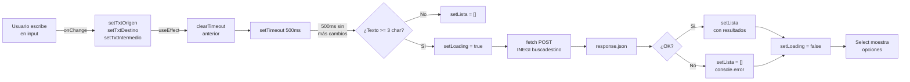
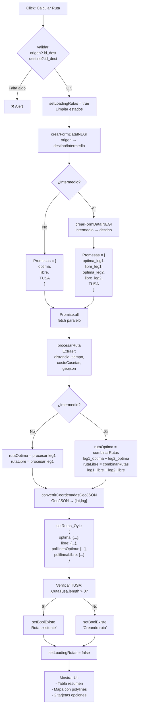
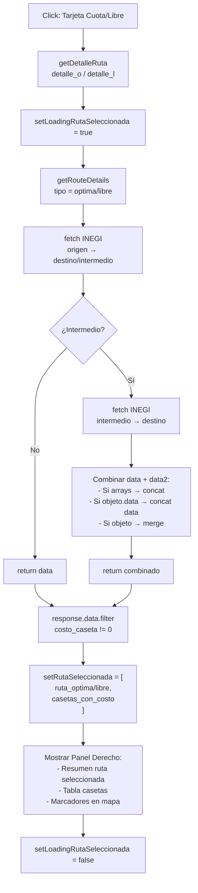
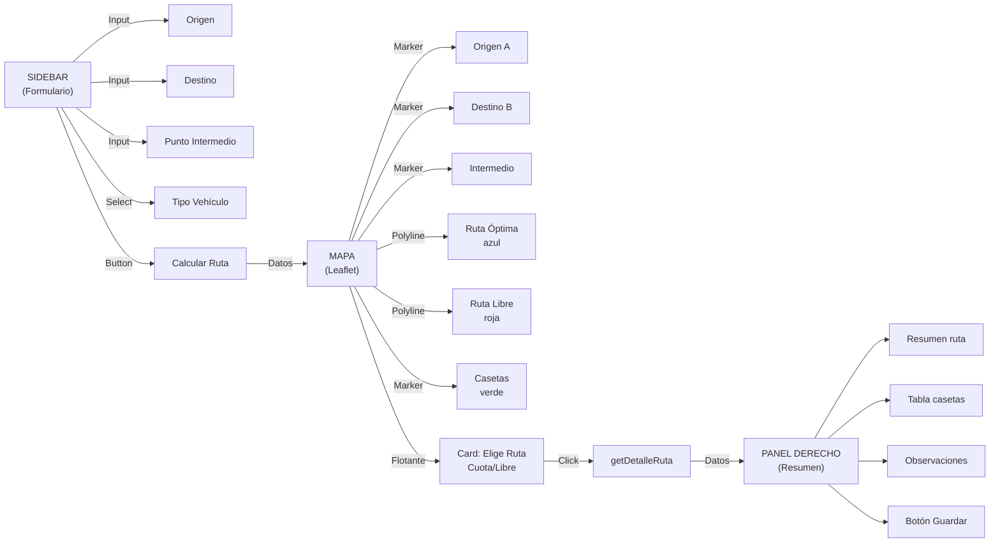

# Diagrama de Flujo - Componente Route-Creator

## Flujo General del Componente

```mermaid
graph TD
    A["🟢 Usuario accede a Route-Creator"] --> B["Interfaz: Formulario con 3 inputs"]
    B --> C["1️⃣ Input: Origen<br/>2️⃣ Input: Destino<br/>3️⃣ Input: Punto Intermedio"]
    
    C --> D["Usuario escribe en campo Origen"]
    D --> E["Debounce 500ms"]
    E --> F{"¿Texto >= 3 caracteres?"}
    F -->|Sí| G["🔍 searchDestinations<br/>API INEGI: buscadestino"]
    F -->|No| H["❌ Limpiar lista Origenes"]
    G --> I["✅ Mostrar opciones en select"]
    I --> J["Usuario selecciona Origen"]
    
    J --> K["🔄 Mismo flujo para:<br/>- Destino<br/>- Punto Intermedio"]
    
    K --> L["Usuario selecciona Tipo de Vehículo"]
    L --> M["Usuario hace clic en 'Calcular ruta'"]
    M --> N{"¿Validación OK?<br/>Origen + Destino"}
    
    N -->|No| O["❌ Alert: Selecciona origen y destino"]
    N -->|Sí| P["🔄 calcularRutaHandler iniciado"]
    
    P --> Q["setLoadingRutas = true<br/>Mostrar spinner"]
    Q --> R{"¿Hay Punto<br/>Intermedio?"}
    
    R -->|No| S["📍 Ruta Simple<br/>Origen → Destino"]
    R -->|Sí| T["📍 Ruta con 2 Legs<br/>Origen → Intermedio<br/>Intermedio → Destino"]
    
    S --> U["⚡ Fetch paralelo x2:<br/>1. optima<br/>2. libre<br/>+ TUSA"]
    T --> V["⚡ Fetch paralelo x5:<br/>1. optima leg1<br/>2. libre leg1<br/>3. optima leg2<br/>4. libre leg2<br/>5. TUSA"]
    
    U --> W["Procesar respuestas<br/>convertirCoordenadasGeoJSON"]
    V --> W
    
    W --> X["¿Ruta en TUSA?"]
    X -->|Sí| Y["Estado: 'Ruta existente'<br/>Mostrar categoría"]
    X -->|No| Z["Estado: 'Creando ruta'<br/>Habilitar nuevo componente"]
    
    Y --> AA["setRutas_OyL:<br/>- optima (distancia, tiempo, costo)<br/>- libre (distancia, tiempo, costo)<br/>- polilineaOptima (para mapa)<br/>- polilineaLibre (para mapa)"]
    Z --> AA
    
    AA --> AB["Mostrar:<br/>- Tabla resumen (distancia, tiempo, costo)<br/>- Dos tarjetas: Cuota/Libre<br/>- Mapa con polylines"]
    
    AB --> AC["Usuario hace clic en Cuota o Libre"]
    AC --> AD["getDetalleRuta('detalle_o')<br/>o<br/>getDetalleRuta('detalle_l')"]
    
    AD --> AE["getRouteDetails:<br/>Fetch casetas con costo"]
    AE --> AF["Combinar respuestas<br/>si hay intermedio"]
    AF --> AG["setRutaSeleccionada:<br/>[rutaSeleccionada, casetas]"]
    
    AG --> AH["Mostrar en panel derecho:<br/>- Resumen ruta<br/>- Tabla casetas<br/>- Marcadores en mapa"]
    
    AH --> AI["Usuario puede:<br/>1. Cambiar tipo traslado<br/>2. Añadir observaciones<br/>3. Guardar ruta<br/>4. Retirar intermedio"]
    
    AI --> AJ["🔄 Volver a calcular"]
```

---

## Flujo Detallado: searchDestinations (Búsqueda con Debounce)

---

## Flujo Detallado: calcularRutaHandler (Cálculo de Rutas)

---

## Flujo Detallado: getDetalleRuta (Seleccionar Ruta)

---

## Flujo: Interfaz Visual (React JSX)

---

## Estados (React Hooks)

| Estado | Tipo | Propósito |
|--------|------|-----------|
| `txtOrigen` | string | Texto buscado origen |
| `txtDestino` | string | Texto buscado destino |
| `txtPuntoIntermedio` | string | Texto buscado intermedio |
| `origenes` | array | Opciones origen (INEGI) |
| `destinos` | array | Opciones destino (INEGI) |
| `puntosIntermedios` | array | Opciones intermedio (INEGI) |
| `origen` | object | Origen seleccionado |
| `destino` | object | Destino seleccionado |
| `puntoIntermedio` | object \| null | Intermedio seleccionado |
| `tipoVehiculo` | number | Tipo vehículo (1-12) |
| `loadingOrigen` | bool | Cargando búsqueda origen |
| `loadingDestino` | bool | Cargando búsqueda destino |
| `loadingPuntoIntermedio` | bool | Cargando búsqueda intermedio |
| `loadingRutas` | bool | Cargando cálculo rutas |
| `loadingRutaSeleccionada` | bool | Cargando detalles ruta |
| `rutas_OyL` | object \| null | Rutas calculadas (optima, libre, polylines) |
| `rutaTusa` | array | Ruta en TUSA (si existe) |
| `rutaSeleccionada` | array | [ruta_detalle, casetas] |
| `boolExiste` | string | Estado ruta: "Ruta existente", "Creando ruta", etc. |

---

## APIs Externas Utilizadas

| API | Endpoint | Método | Propósito |
|-----|----------|--------|-----------|
| INEGI | `sakbe_v3.1/buscadestino` | POST | Buscar poblaciones |
| INEGI | `sakbe_v3.1/optima` | POST | Calcular ruta óptima |
| INEGI | `sakbe_v3.1/libre` | POST | Calcular ruta libre |
| TUSA (Backend) | `/api/casetas/rutas/BuscarRutaPorOrigen_Destino` | POST | Verificar si ruta existe |

---

## Notas de Flujo

✅ **Debounce**: Se usa para evitar exceso de requests al escribir en inputs (500ms)

✅ **Parallelización**: Fetch de múltiples rutas se hace con `Promise.all` para optimizar

✅ **Combinación de Legs**: Si hay intermedio, se combinan dos legs (origen→intermedio, intermedio→destino) sumando distancias, tiempos y costos

✅ **Conversión GeoJSON**: Las polylines se convierten de [lng, lat] a [lat, lng] para Leaflet

✅ **Estados de Carga**: Múltiples flags para mostrar spinners en diferentes partes de la UI

⚠️ **Manejo de Errores**: Try/catch en funciones async con alerts al usuario

🔄 **Reutilización**: Función `searchDestinations` genérica para los 3 tipos de búsqueda
